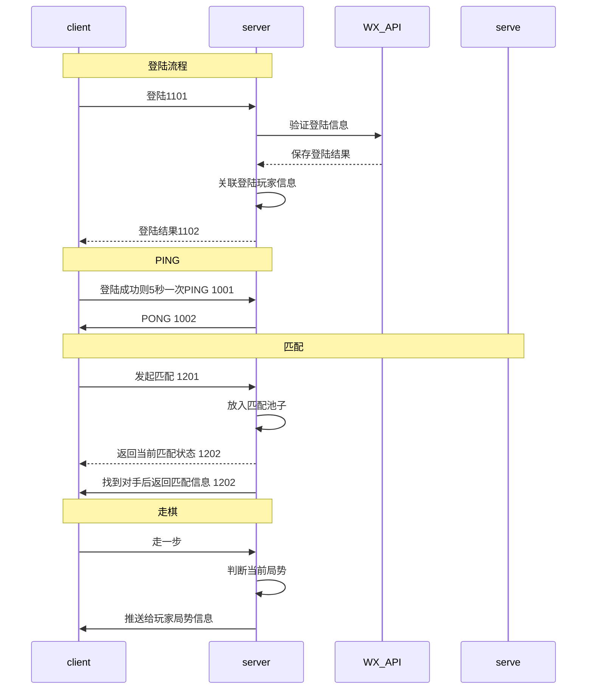

# TServerGo


## 目标
想要做一个五子棋的小游戏，后端用go实现，前端用微信小游戏。因此通信协议应该就只能使用websocket了

## TDL

1. go实现websocket
2. websocket+json协议交互

## go labstack

```
go get github.com/labstack/echo/v4/middleware
go get github.com/labstack/echo/v4
```


##
1. 如何在Canvas里面放一张图片，
2. 在Canvas放置一枚棋子，位置怎么确定

## 功能

### PING

Req ID:1001


| -         | -   |            |
| --------- | --- | ---------- |
| id        | int | 1001       |
| timestamp | int | 时间戳(秒) |

Res ID:1002

| -         | -   |            |
| --------- | --- | ---------- |
| id        | int | 1002       |
| timestamp | int | 时间戳(秒) |


```json
{"id":1001,"timestamp":1621521841}
```

### 登陆

Req ID : 1101

| -         | -      | -       |
| --------- | ------ | ------- |
| id        | int    | 1101    |
| nickName  | string | 昵称    |
| avatarUrl | string | 头像    |
| token     | string | js_code |

Res ID : 1102

| -         | -      | -        |
| --------- | ------ | -------- |
| id        | int    | 1101     |
| errorCode | string | 错误信息 |
| openId    | string |          |

```json
{"id": 1101,"nickName":"条鱼鱼丶炕","token":"0311lZ000MMFKL1qpI100iKyxo41lZ0s","avatarUrl":""}
```

### 匹配

Req ID:  1201

| -         |     |      |          |
| --------- | --- | ---- | -------- |
| id        | int | 1201 |          |
| matchType | int | 1    | 匹配     |
|           |     | 2    | 取消匹配 |

Res ID: 1202

| -              |        |          |            |
| -------------- | ------ | -------- | ---------- |
| id             | int    | 1202     |            |
| errorCode      | string | MATCHING | 正在匹配中 |
|                |        | FAILED   | 匹配失败   |
|                |        | TIMEOUT  | 匹配超时   |
|                |        | SUCCESS  | 匹配成功   |
| enemyName      | string |          | 对手名字   |
| enemyAvatarUrl | string |          | 对手头像   |
| color          | int    | 1        | 红方(先手) |
|                |        | 2        | 黑方       |

```json
{"id":1201}
```

### 走棋

Req ID: 1301

| -    |      |      |
| ---- | ---- | ---- |
| id   | int  | 1301 |
| step | step |      |

step 步信息

| -     |     |
| ----- | --- |
| pos   | pos |
| color | int |


pos 位置信息

| -   |     |
| --- | --- |
| X   | int |
| Y   | int |


Res ID: 1302

| -         |        |                 |
| --------- | ------ | --------------- |
| id        | int    | 1302            |
| errorCode | string |                 |
| steps     | step[] | 数组 记录所有步 |

```json
{"id":1301,"step":{"pos":{"x":6,"y":6},"color":"RED"}}
```

### 对局结果

Res ID : 1402

| -          |        |      |
| ---------- | ------ | ---- |
| id         | int    | 1402 |
| errorCode  | string |      |
| gameResult | string | WIN  |
|            |        | LOSE |

## 流程图



## 协议

加入t转成 byte数组后，数组长度为10
t这个协议号是 1001，1001转成byte数组后，数组长度为4
10 + 4 + 4 = 18
[长度][协议号][协议本身]
