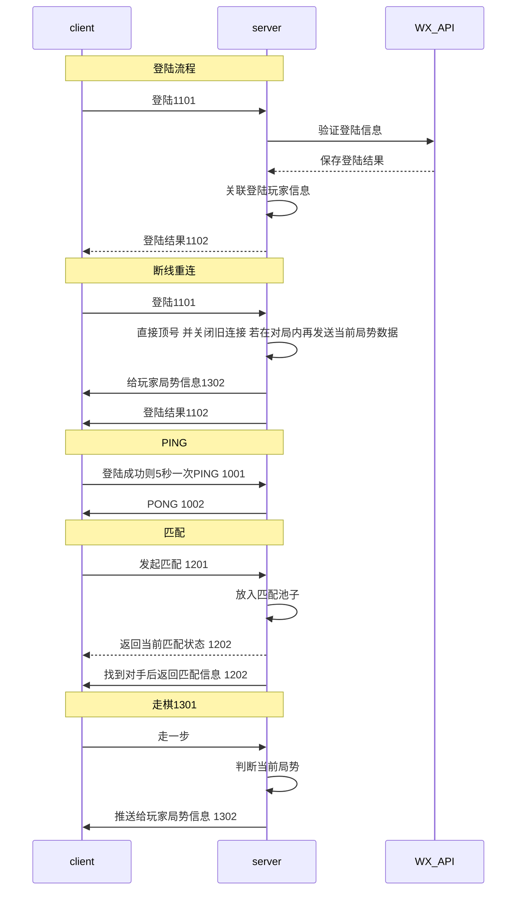

TServerGo
=========

[TOC]

## 目标

想要做一个五子棋的小游戏， 后端用go实现， 前端用微信小游戏实现。

前端微信小游戏实现传送门[https://github.com/MachineDream/tiaoyuGame](https://github.com/MachineDream/tiaoyuGame)

## 下一步目标

|     |                                  |
| --- | -------------------------------- |
| 1   | 胜负局数以及分数统计             |
| 2   | 手动创建房间并可邀请他人加入对局 |
| 3   | 可以进入某个对局观战             |
| 4   | 可以重放某个对局                 |

## 进度

| -          | -                                |
| ---------- | -------------------------------- |
| 2021.05.29 | 完成前后端一个完整的匹配对局流程 |

## 功能协议

### PING

Req ID:1001


| -         | -   |            |
| --------- | --- | ---------- |
| Id        | int | 1001       |
| Timestamp | int | 时间戳(秒) |

Res ID:1002

| -         | -   |            |
| --------- | --- | ---------- |
| Id        | int | 1002       |
| Timestamp | int | 时间戳(秒) |


```json
{"id":1001,"timestamp":1621521841}
```

### 登陆

Req ID : 1101

| -         | -      | -       |
| --------- | ------ | ------- |
| Id        | int    | 1101    |
| NickName  | string | 昵称    |
| AvatarUrl | string | 头像    |
| Token     | string | js_code |

Res ID : 1102

| -         | -      | -        |
| --------- | ------ | -------- |
| Id        | int    | 1101     |
| ErrorCode | string | 错误信息 |
| OpenId    | string |          |

```json
{"id": 1101,"nickName":"条鱼鱼丶炕","token":"0311lZ000MMFKL1qpI100iKyxo41lZ0s","avatarUrl":""}
```

### 匹配

Req ID:  1201

| -         |     |      |          |
| --------- | --- | ---- | -------- |
| Id        | int | 1201 |          |
| MatchType | int | 1    | 匹配     |
|           |     | 2    | 取消匹配 |

Res ID: 1202

| -              |        |          |            |
| -------------- | ------ | -------- | ---------- |
| Id             | int    | 1202     |            |
| ErrorCode      | string | MATCHING | 正在匹配中 |
|                |        | FAILED   | 匹配失败   |
|                |        | TIMEOUT  | 匹配超时   |
|                |        | SUCCESS  | 匹配成功   |
|                |        | CANCEL   | 取消成功   |
| EnemyName      | string |          | 对手名字   |
| EnemyAvatarUrl | string |          | 对手头像   |
| Color          | int    | 1        | 红方(先手) |
|                |        | 2        | 黑方       |

```json
{"id":1201,"matchType":1}
```

### 走棋

Req ID: 1301

| -    |      |      |
| ---- | ---- | ---- |
| Id   | int  | 1301 |
| Step | step |      |

step 步信息

| -     |     |
| ----- | --- |
| Pos   | pos |
| Color | int |


pos 位置信息

| -   |     |
| --- | --- |
| X   | int |
| Y   | int |


Res ID: 1302

| -         |        |                 |
| --------- | ------ | --------------- |
| Id        | int    | 1302            |
| ErrorCode | string |                 |
| Steps     | step[] | 数组 记录所有步 |

```json
{"id":1301,"step":{"pos":{"x":6,"y":6},"color":1}}
```

### 对局结果

Res ID : 1402

| -          |        |      |
| ---------- | ------ | ---- |
| Id         | int    | 1402 |
| ErrorCode  | string |      |
| GameResult | string | WIN  |
|            |        | LOSE |

## 流程图


